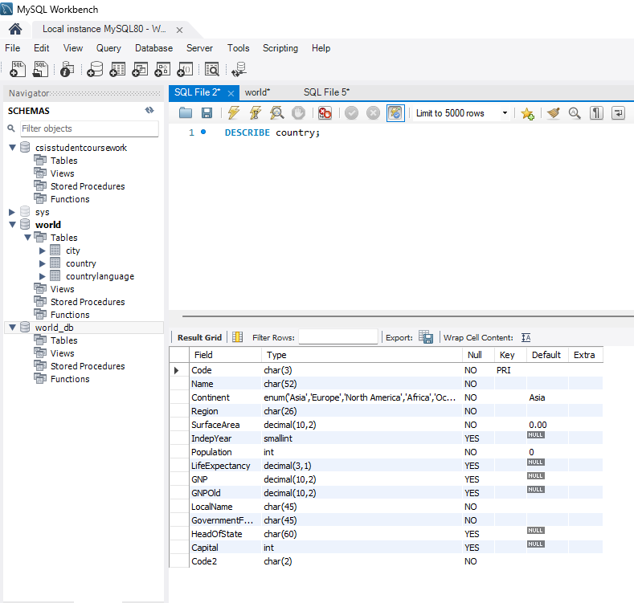
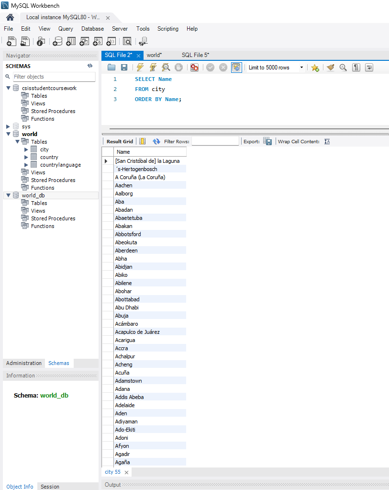
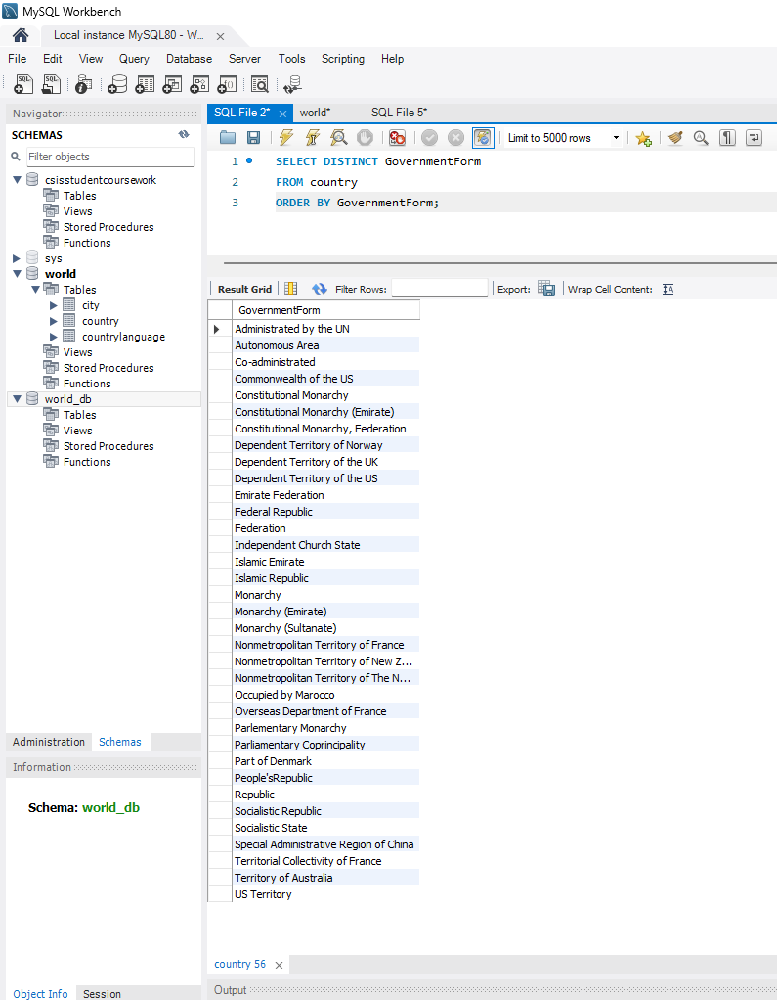
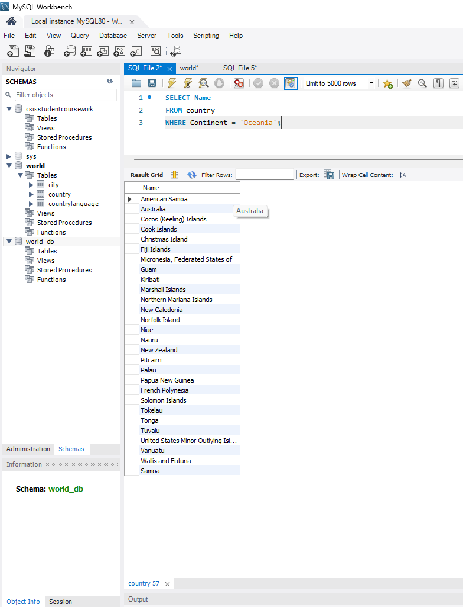
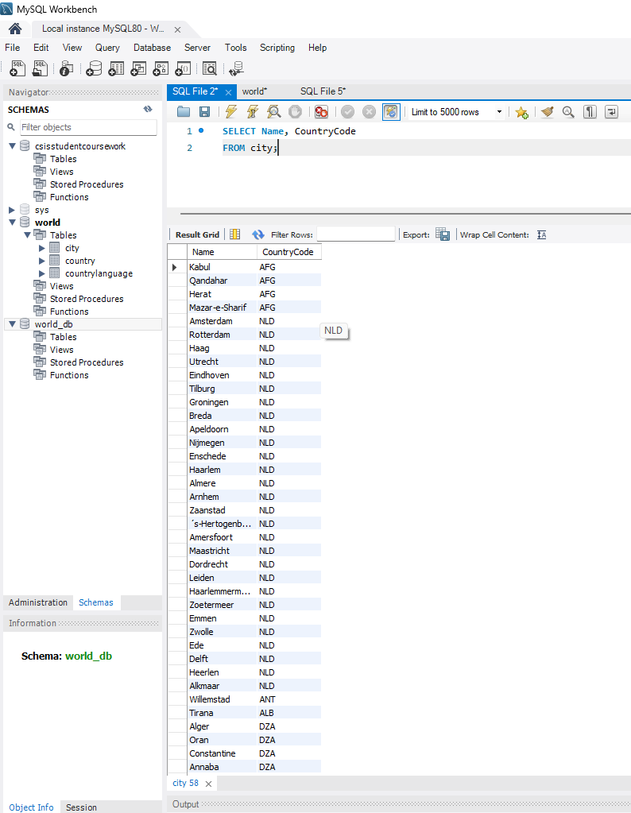
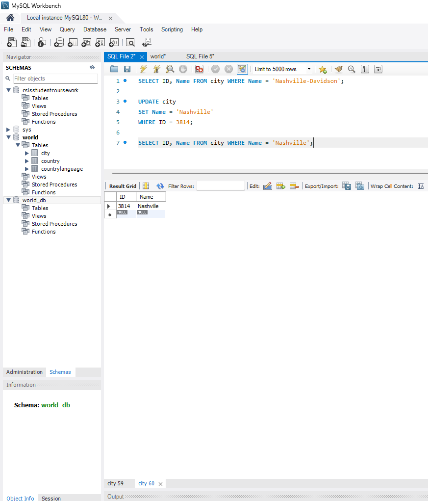
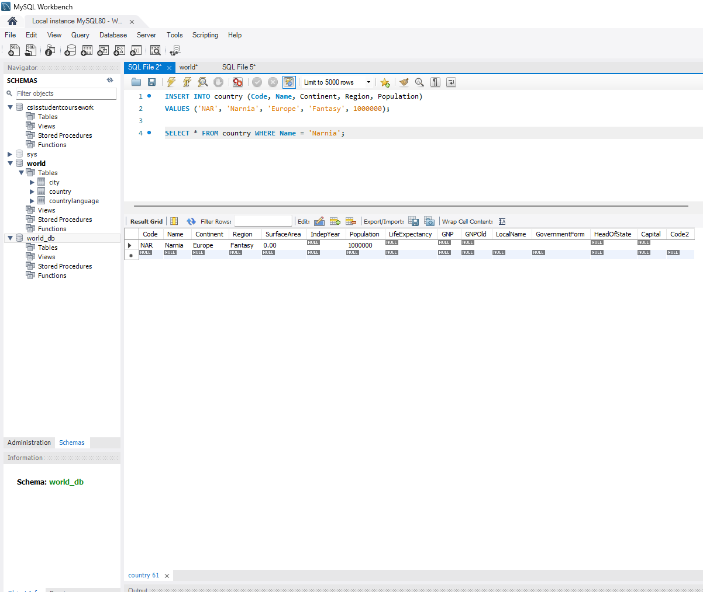

# Exercise 01: World Database SQL Practice

- Name: Oluwafemi Salawu
- Course: Database for Analytics
- Module: 1
- Database Used: World Database

---

## Instructions

- Answer each question below.
- All SQL commands **must be executed** against the World database.
- For each SQL command:
  - Include the SQL in a fenced code block
  - Include a **screenshot** showing the command and results
- Store screenshots in the `screenshots/` folder and embed them below each answer.

---

## Question 1

**Compare and contrast the data types used for:**
- `country.Population`
- `country.LifeExpectancy`

Why were these data types selected?

### Answer
_country.Population is an INT because population is a whole-number count of people (discrete values). You don’t have “half a person,” so an integer type is appropriate and efficient for storage and comparisons._

_country.LifeExpectancy is a DECIMAL(3,1) because life expectancy is a measured value that often includes one decimal place (e.g., 78.4 years)._

### Screenshot
_Show the table structure or DESCRIBE output._

```sql
DESCRIBE country;
```


---

## Question 2

**What is the data type of `country.IndepYear`?**
Why do you think this data type was selected?

### Answer
_This type was selected because independence years are small whole numbers (e.g., 1919, 1975) that fit well within the range of SMALLINT, and it uses less storage than a full INT. It’s also set to allow NULL, which makes sense because some countries/territories may not have an independence year._

### Screenshot

```sql
DESCRIBE country;
```


---

## Question 3

**Make a case for a different data type for `country.IndepYear`.**
Explain why your proposed data type might be better in some situations.

### Answer
_A good alternative could be YEAR._

_YEAR is purpose-built to store year values and can make the schema more semantically clear (it signals that the value is strictly a year). It can also help reduce invalid inputs (like 123 or 99999) depending on constraints and how your system validates entries. In datasets where the column is always a year and you don’t need full date precision, YEAR can be cleaner and easier to understand._

---

## Question 4

Write a SQL command to **list the names of all cities in alphabetical order**.

### SQL

```sql
SELECT Name
FROM city
ORDER BY Name;
```

### Screenshot



---

## Question 5

Write a SQL command to **list all forms of government from the `country` table**, showing **each only once**, sorted alphabetically.

### SQL

```sql
SELECT DISTINCT GovernmentForm
FROM country
ORDER BY GovernmentForm;
```

### Screenshot



---

## Question 6

Write a SQL command to **list all countries in the `Oceania` continent**.

### SQL

```sql
SELECT Name
FROM country
WHERE Continent = 'Oceania';
```

### Screenshot



---

## Question 7

Write a SQL command to **list the names and country code of all cities**.

### SQL

```sql
SELECT Name, CountryCode
FROM city;
```

### Screenshot



---

## Question 8

Write a SQL command to **update the city named `"Nashville-Davidson"` to `"Nashville"`**.

### SQL

```sql
SELECT ID, Name FROM city WHERE Name = 'Nashville-Davidson';

UPDATE city
SET Name = 'Nashville'
WHERE ID = 3814;

SELECT ID, Name FROM city WHERE Name = 'Nashville';
```

### Screenshot



---

## Question 9

Write a SQL command to **insert a new country named `"Narnia"`** with a country code of `"NAR"`.
Use reasonable values for the remaining columns.

### SQL

```sql
INSERT INTO country (Code, Name, Continent, Region, Population)
VALUES ('NAR', 'Narnia', 'Europe', 'Fantasy', 1000000);

SELECT * FROM country WHERE Name = 'Narnia';
```

### Screenshot



---

## Question 10

Write a SQL command to **delete the country with the country code `"NAR"`**.

### SQL

```sql
DELETE FROM country
WHERE Code = 'NAR';

SELECT * FROM country WHERE Code = 'NAR';
```

### Screenshot


