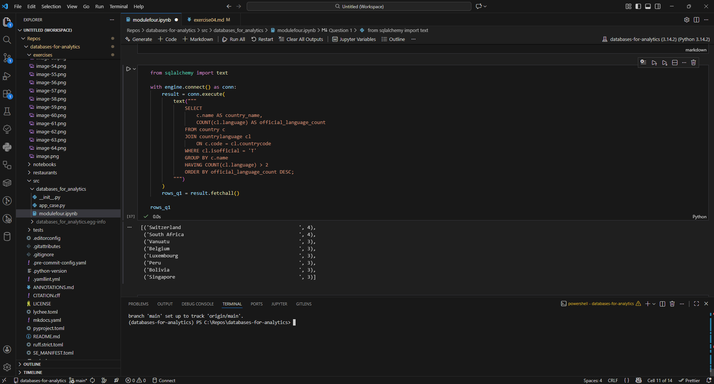
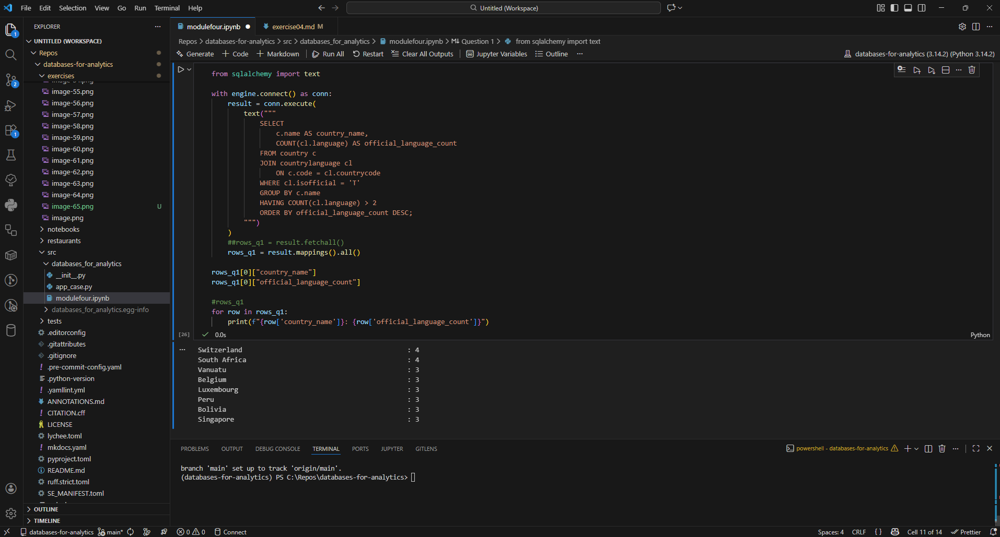
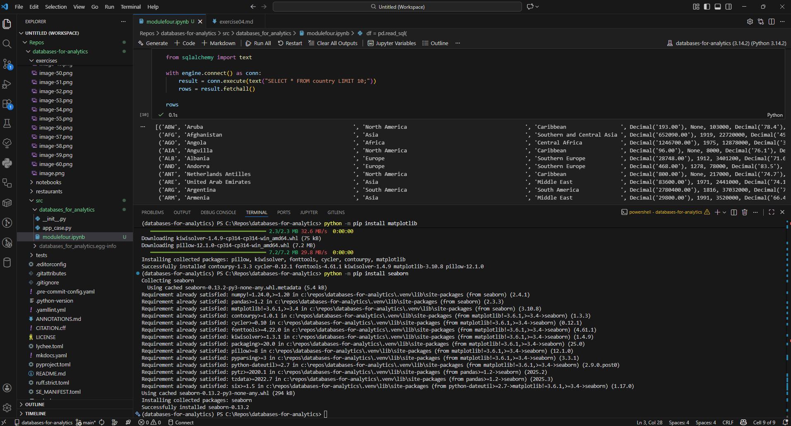
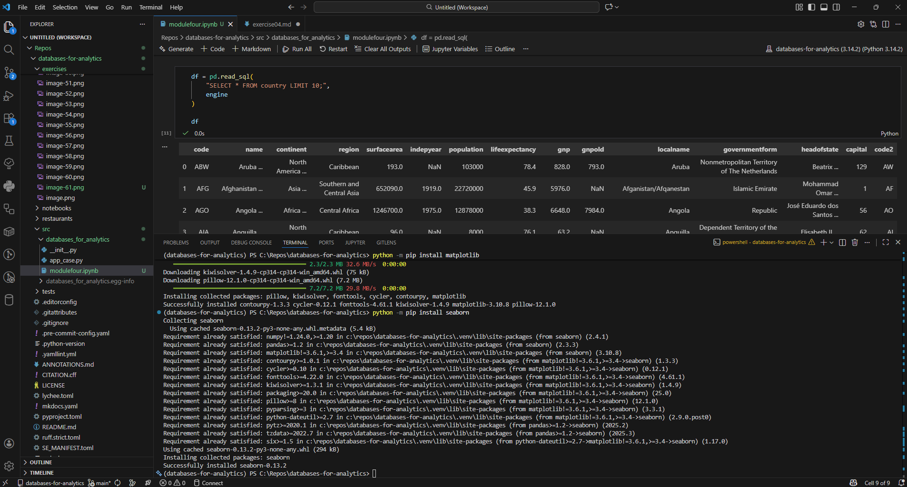
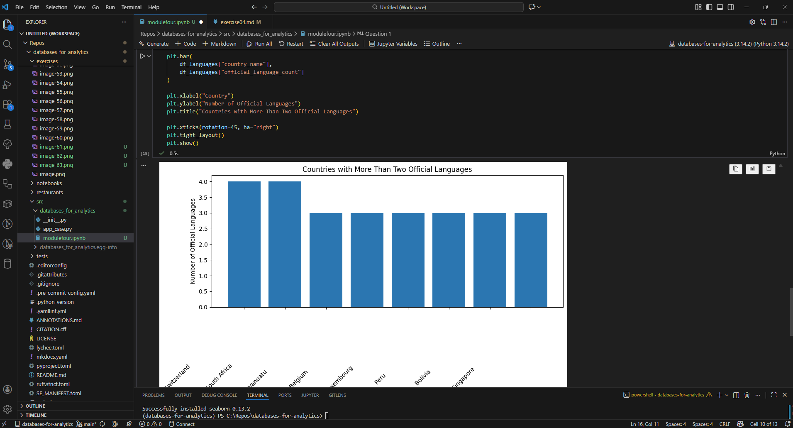

# Exercise 04: Advanced SQL, Jupyter, and Visualization

- Name:
- Course: Database for Analytics
- Module:
- Database Used: World Database
- Tools Used: PostgreSQL, SQLAlchemy, Pandas, Jupyter Notebooks

---

## Instructions

- Complete each task using the **World database** installed earlier.
- For SQL questions:
  - Write the SQL command in a fenced code block
  - Execute the command and include a **screenshot of the results**
- For Jupyter Notebook questions:
  - Include the required Python statements
  - Include **screenshots of the notebook output**
- Store all screenshots in the `screenshots/` folder and embed them below each question.

---

## Question 1

Considering the World database, write a SQL statement that will **display the names of countries that speak more than two official languages**, along with the **number of official languages spoken**.

- Sort the results by **number of languages**, from **most to least**.
- *Hint: There are fewer than 10 countries in the results.*

### SQL

```sql
from sqlalchemy import text
from sqlalchemy import text

with engine.connect() as conn:
    result = conn.execute(
        text("""
            SELECT
                c.name AS country_name,
                COUNT(cl.language) AS official_language_count
            FROM country c
            JOIN countrylanguage cl
                ON c.code = cl.countrycode
            WHERE cl.isofficial = 'T'
            GROUP BY c.name
            HAVING COUNT(cl.language) > 2
            ORDER BY official_language_count DESC;
        """)
    )
    ##rows_q1 = result.fetchall()
    rows_q1 = result.mappings().all()

rows_q1[0]["country_name"]
rows_q1[0]["official_language_count"]

#rows_q1
for row in rows_q1:
    print(f"{row['country_name']}: {row['official_language_count']}")

OR

query = """
SELECT
    c.name AS country_name,
    COUNT(cl.language) AS official_language_count
FROM country c
JOIN countrylanguage cl
    ON c.code = cl.countrycode
WHERE cl.isofficial = 'T'
GROUP BY c.name
HAVING COUNT(cl.language) > 2
ORDER BY official_language_count DESC;
"""

df_languages = pd.read_sql(query, engine)
df_languages
```

### Screenshot





---

## Question 2

Using **Jupyter Notebooks**, you must use the `create_engine` command to connect to your database.

After the `create_engine` command is executed, **what are the three statements required to execute the query from Question 1 and display the results in the notebook**?

### Required Steps are:
_`from sqlalchemy import text` In SQLAlchemy 2.x, raw SQL must be wrapped in text() before execution. Without this, SQLAlchemy may raise an error or treat the string incorrectly._
_`with engine.connect() as conn:`_
    _engine = your database configuration (host, DB name, credentials)_
    _connect() opens a database connection_
    _with ... as ... is a context manager_
_`conn.execute(...)` 
    _conn.execute() sends the SQL to PostgreSQL_
    _text("SELECT ...") is the SQL statement_
    _The database executes the query_
    _The returned object (result) is a Result object, not the data yet_
_`rows = result.fetchall()` fetchall() retrieves all rows returned by the query_
_`rows` Displays its contents automatically. This is why you don’t need print(rows)._

_Define the SQL query `query = """<your SQL query here>"""`._
_Execute the SQL query using pandas `df = pd.read_sql(query, engine)`._
_Display the results `df`._

### Python Code

```python
from sqlalchemy import text

with engine.connect() as conn:
    result = conn.execute(text("SELECT * FROM country LIMIT 10;"))
    rows = result.fetchall()

rows

OR

df = pd.read_sql(
    "SELECT * FROM country LIMIT 10;",
    engine
)

df
```

### Screenshot





---

## Question 3

Using **Jupyter Notebooks**, write the Python code needed to produce the following graph:


(The graph shows country-level results derived from the World database.)

### Python Code

```python
import matplotlib.pyplot as plt

plt.figure(figsize=(10, 6))

plt.bar(
    df_languages["country_name"],
    df_languages["official_language_count"]
)

plt.xlabel("Country")
plt.ylabel("Number of Official Languages")
plt.title("Countries with More Than Two Official Languages")

plt.xticks(rotation=45, ha="right")
plt.tight_layout()
plt.show()
```

### Screenshot



