# Module 7 - Exercise 1: Bringing it all together
Locating and Installing your Data

- Name: Oluwafemi Salawu
- Course: Database for Analytics
- Module: 6
- Database Used: Movies_db
- Tools Used: PostgreSQL

---

## Overview

I used a Jupyter Notebook in VS Code with Pandas and SQLAlchemy to load the IMDb TSV file into PostgreSQL. Pandas was used to safely read the file using Windows-1252 encoding and convert IMDb’s \N values to nulls. SQLAlchemy then handled the database connection, and the data was inserted in chunks to efficiently load the large dataset without encoding or permission issues.

## Why this approach works so well (important insight)

- Pandas handles broken encodings gracefully
- Python ignores illegal bytes instead of crashing
- PostgreSQL receives clean Unicode strings
- This is how ETL pipelines are often built in practice


Below is a **ready-to-paste Markdown (.md) response** formatted for Visual Studio Code.

You can drop this directly into your assignment file.

---

# IMDb Data Engineering Project

## Initial Data Source

The initial data source used for this project was the public IMDb datasets downloaded from:

[https://datasets.imdbws.com/](https://datasets.imdbws.com/)

The following TSV files were used and loaded into PostgreSQL:

* `name.basics.tsv`
* `title.basics.tsv`
* `title.principals.tsv`
* `title.crew.tsv`
* `title.episode.tsv`
* `title.ratings.tsv`

These files contain structured data describing people, titles, ratings, and relationships between them.

---

## Data Format

The source data was provided as **TSV (Tab-Separated Values)** files.

Each file:

* Uses tab characters as delimiters
* Uses `\N` to represent NULL values
* Contains mixed encodings and very large row counts

### Tables Loaded

| Table          | Columns | Row Count        |
|----------------|---------|------------------|
| name_basics    | 6       | 15,053,659       |
| title_basics   | 9       | 12,256,479       |
| title_crew     | 3       | 12,258,771       |
| title_episode  | 4       | 9,458,778        |
| title_ratings  | 3       | 1,630,292        |

The data was loaded using Pandas ETL and inserted into PostgreSQL.

---

## Data Dictionary

### name_basics

| Column             | Description                    |
| ------------------ | ------------------------------ |
| nconst             | Unique IMDb person ID          |
| primary_name       | Person’s name                  |
| birth_year         | Year of birth                  |
| death_year         | Year of death                  |
| primary_profession | Professions (comma-separated)  |
| known_for_titles   | Titles the person is known for |

---

### title_basics

| Column          | Description                  |
| --------------- | ---------------------------- |
| tconst          | Unique IMDb title ID         |
| title_type      | Movie, short, tvSeries, etc. |
| primary_title   | Main title                   |
| original_title  | Original language title      |
| is_adult        | 0 or 1                       |
| start_year      | Release year                 |
| end_year        | End year (series)            |
| runtime_minutes | Runtime                      |
| genres          | Comma-separated genres       |

---

### title_crew

| Column    | Description                |
| --------- | -------------------------- |
| tconst    | Title ID                   |
| directors | Comma-separated person IDs |
| writers   | Comma-separated person IDs |

---

### title_episode

| Column         | Description |
| -------------- | ----------- |
| tconst         | Episode ID  |
| parent_tconst  | Series ID   |
| season_number  | Season      |
| episode_number | Episode     |

---

### title_ratings

| Column         | Description     |
| -------------- | --------------- |
| tconst         | Title ID        |
| average_rating | IMDb rating     |
| num_votes      | Number of votes |

---

## Obstacles Overcome During Transformation

Several real-world data engineering challenges were encountered:

* File permission errors when attempting PostgreSQL COPY
* Encoding issues (invalid byte sequences)
* BOM (Byte Order Mark) corruption
* Header row misinterpretation
* Mixed encodings causing import failures
* Data type mismatches
* NULL value handling using `\N`

These were resolved by:

* Using Pandas ETL instead of COPY
* Ignoring invalid encoding bytes
* Converting numeric fields safely
* Loading data in chunks to avoid memory issues
* Renaming columns to match PostgreSQL schema

---

## Table Structures

### name_basics

```sql
SELECT column_name, data_type
FROM information_schema.columns
WHERE table_name = 'name_basics';
```
| Column Name        | Data Type |
| ------------------ | --------- |
| birth_year         | integer   |
| death_year         | integer   |
| nconst             | text      |
| primary_name       | text      |
| primary_profession | text      |
| known_for_titles   | text      |

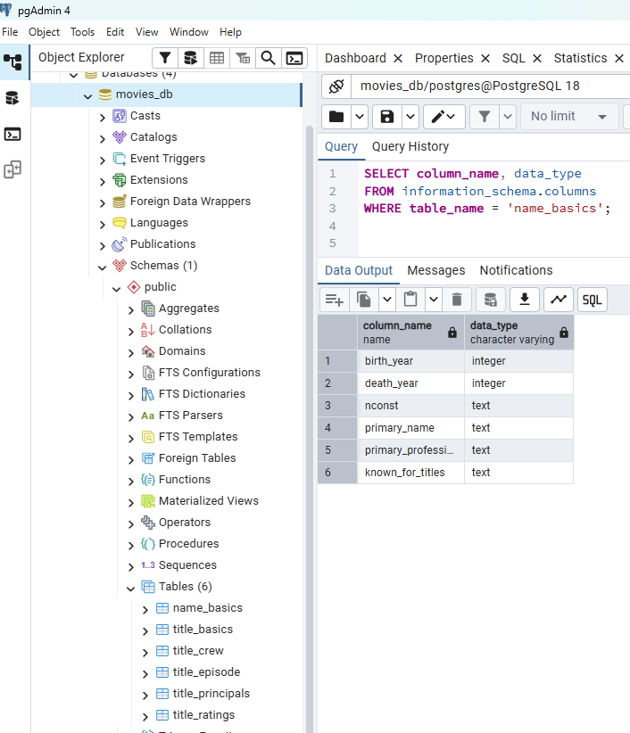

### title_basics

```sql
SELECT column_name, data_type
FROM information_schema.columns
WHERE table_name = 'title_basics';
```
| Column Name     | Data Type |
| --------------- | --------- |
| start_year      | integer   |
| end_year        | integer   |
| runtime_minutes | integer   |
| is_adult        | integer   |
| tconst          | text      |
| genres          | text      |
| title_type      | text      |
| primary_title   | text      |
| original_title  | text      |

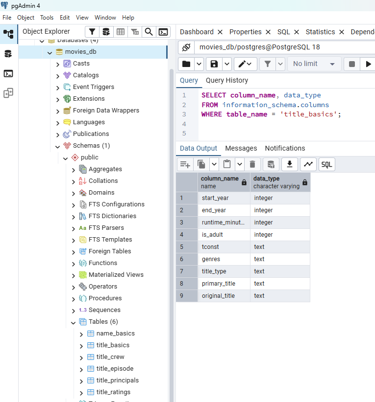

### title_crew

```sql
SELECT column_name, data_type
FROM information_schema.columns
WHERE table_name = 'title_crew';
```
| Column Name | Data Type |
| ----------- | --------- |
| tconst      | text      |
| directors   | text      |
| writers     | text      |

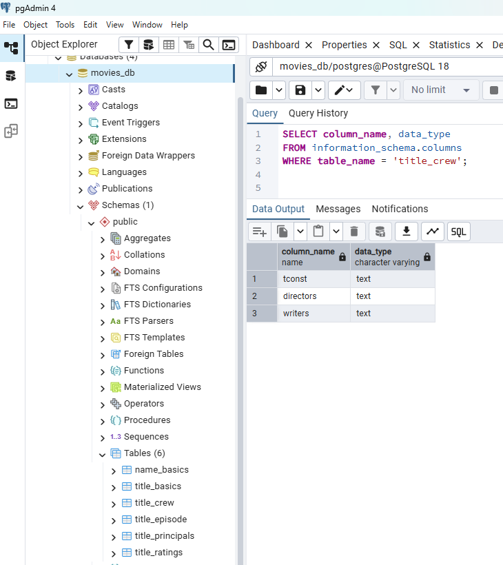

### title_episode

```sql
SELECT column_name, data_type
FROM information_schema.columns
WHERE table_name = 'title_episode';
```
| Column Name    | Data Type |
| -------------- | --------- |
| season_number  | integer   |
| episode_number | integer   |
| tconst         | text      |
| parent_tconst  | text      |

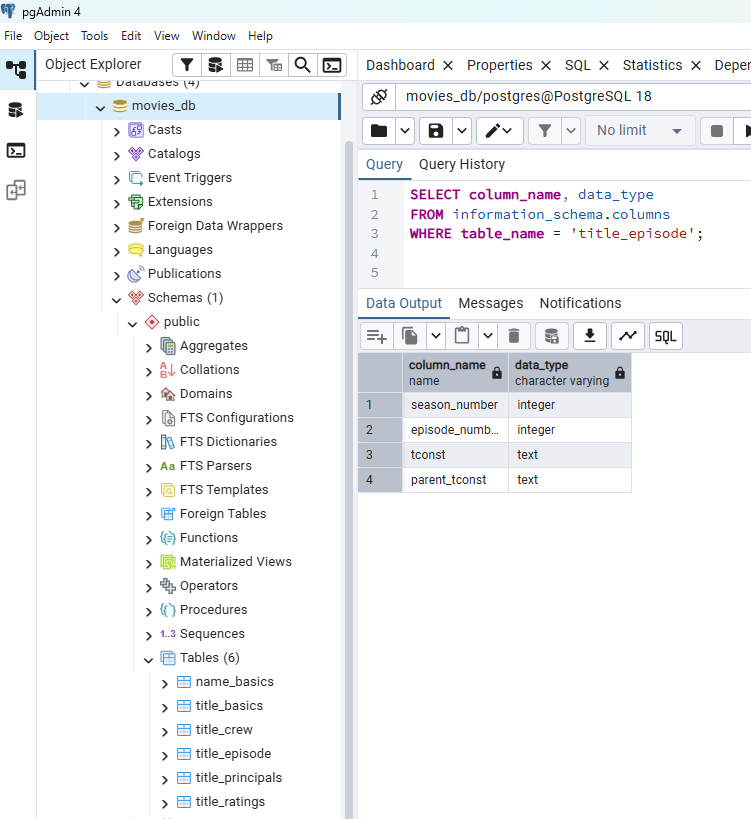

### title_ratings

```sql
SELECT column_name, data_type
FROM information_schema.columns
WHERE table_name = 'title_ratings';
```
| Column Name    | Data Type |
| -------------- | --------- |
| average_rating | numeric   |
| num_votes      | integer   |
| tconst         | text      |

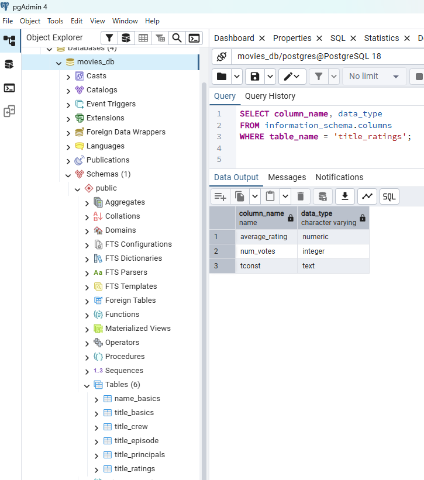

---

## View Data in Tables

### name_basics

```sql
SELECT * FROM name_basics LIMIT 10;
```
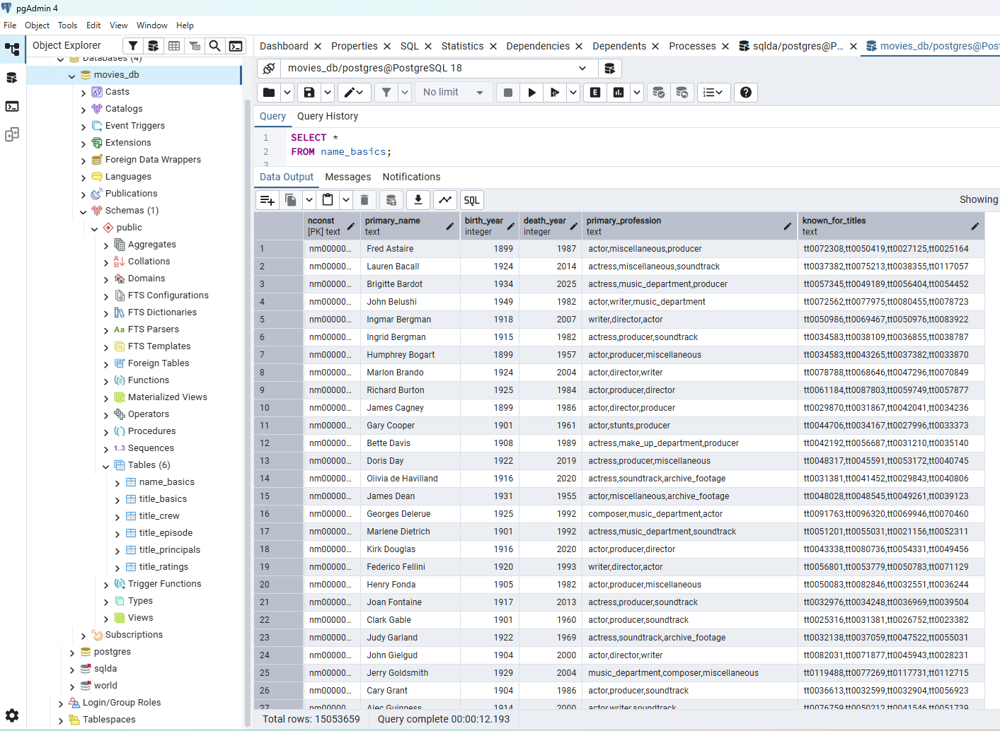

### title_basics

```sql
SELECT * FROM title_basics LIMIT 10;
```
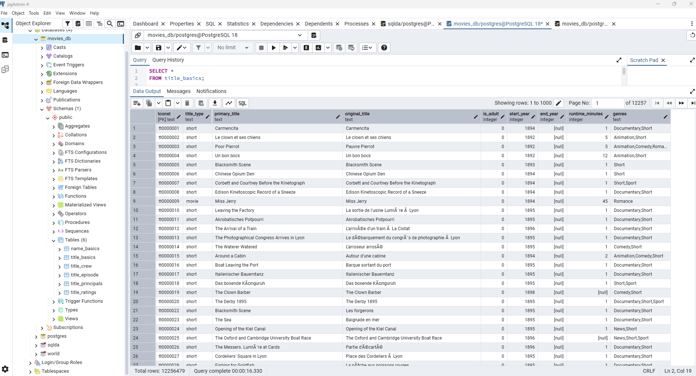

### title_crew

```sql
SELECT * FROM title_crew LIMIT 10;
```
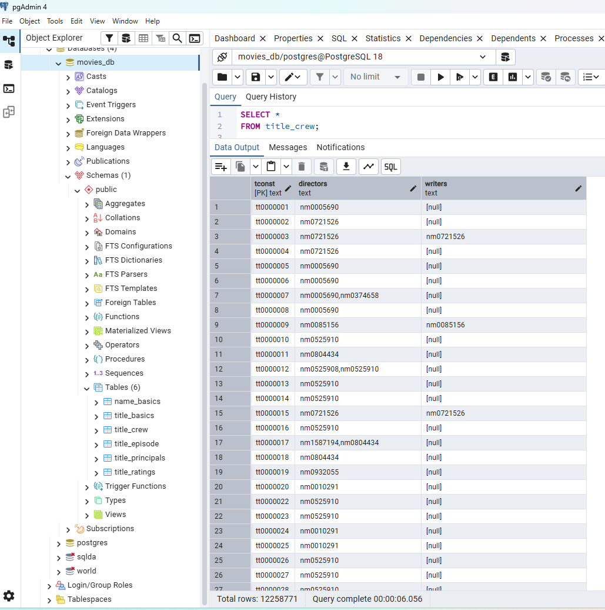

### title_episode

```sql
SELECT * FROM title_episode LIMIT 10;
```
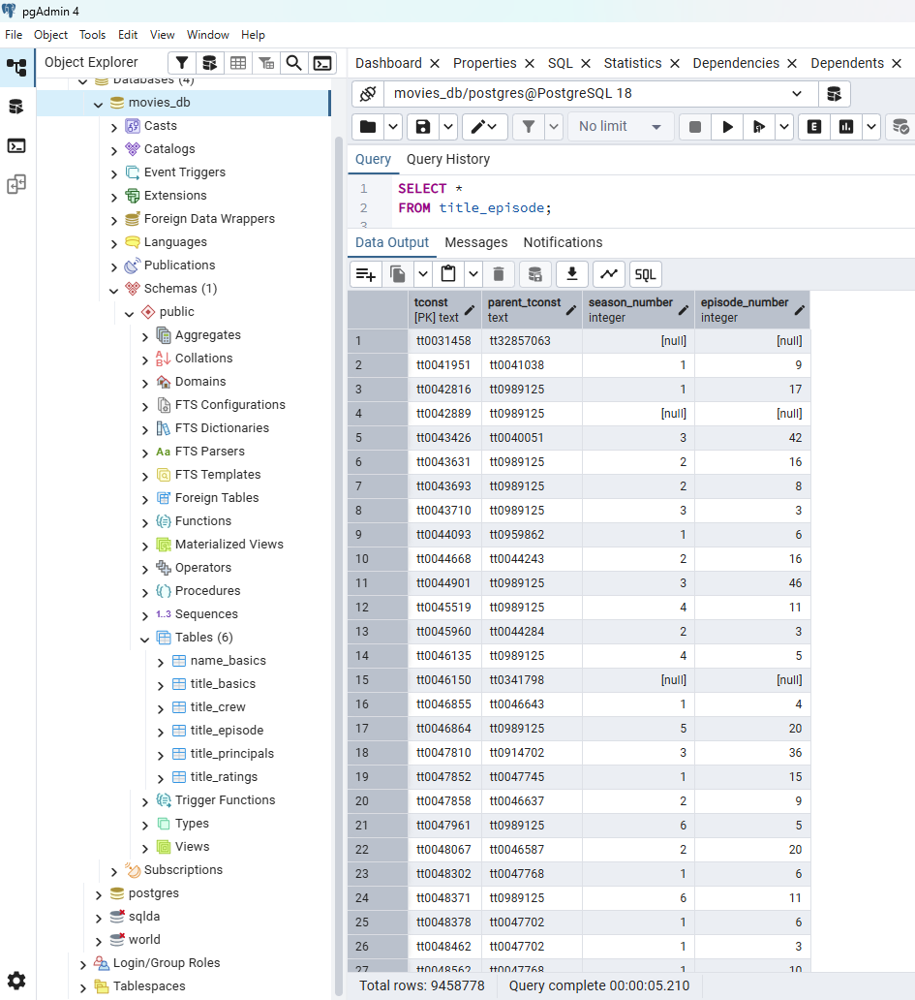

### title_ratings

```sql
SELECT * FROM title_ratings LIMIT 10;
```
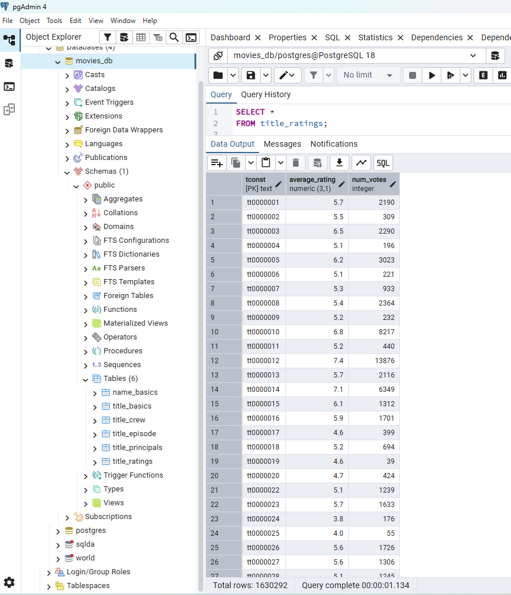

---

## Interesting Queries

### Join Example

(Join titles with ratings)

```sql
SELECT 
    t.primary_title,
    t.start_year,
    r.average_rating,
    r.num_votes
FROM title_basics t
JOIN title_ratings r
    ON t.tconst = r.tconst
ORDER BY r.average_rating DESC
LIMIT 20;
```
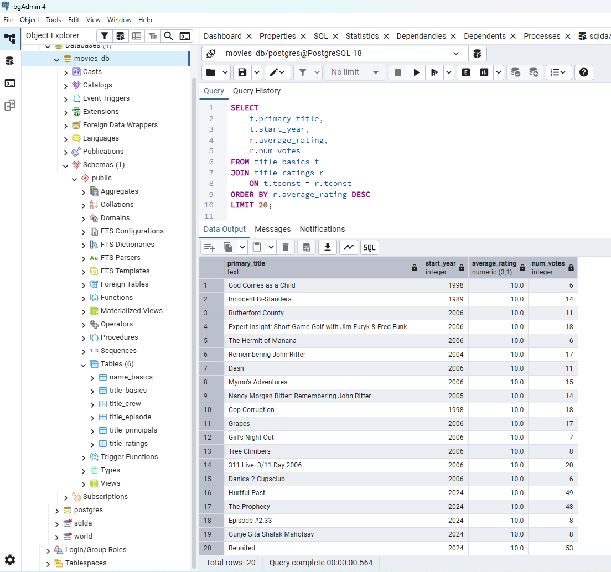

---

### Group By + Aggregation Example

Average rating by title type:

```sql
SELECT 
    t.title_type,
    COUNT(*) AS total_titles,
    AVG(r.average_rating) AS avg_rating
FROM title_basics t
JOIN title_ratings r
    ON t.tconst = r.tconst
GROUP BY t.title_type
ORDER BY avg_rating DESC;
```
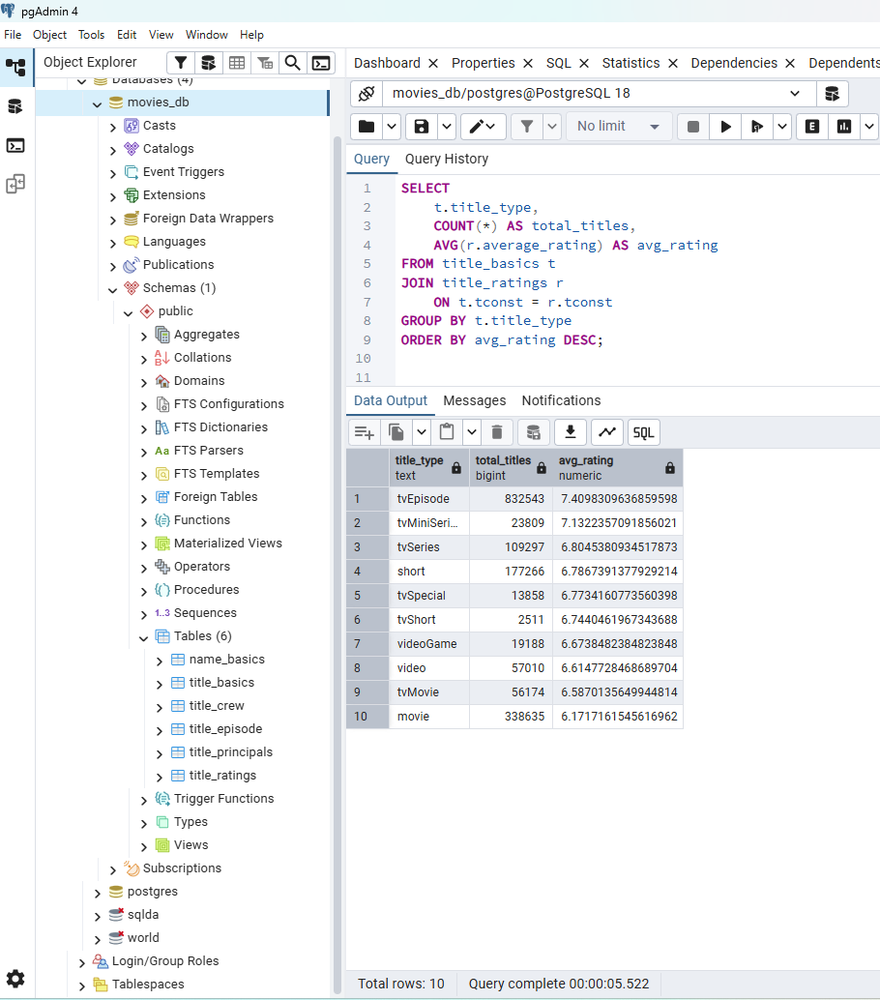

---

### Another Aggregation Example

Top genres by number of titles:

```sql
SELECT 
    genres,
    COUNT(*) AS total_titles
FROM title_basics
GROUP BY genres
ORDER BY total_titles DESC
LIMIT 10;
```
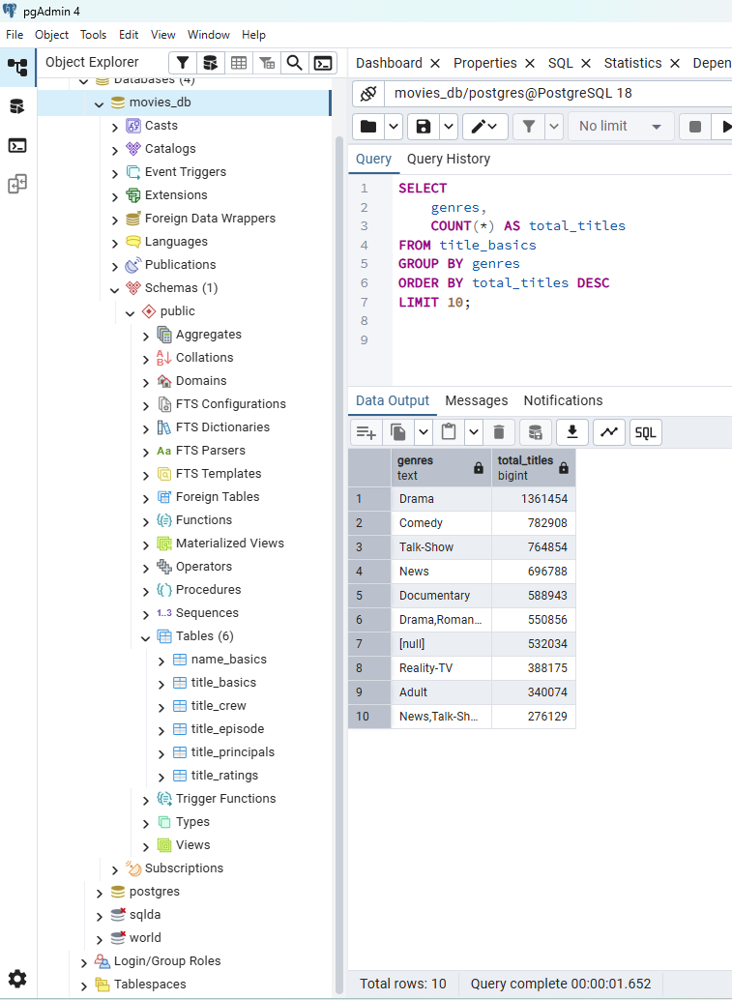

---

## Summary

This project demonstrates:

* Loading large TSV datasets into PostgreSQL
* Handling real-world encoding issues
* Designing a structured schema
* Performing joins across related tables
* Aggregating and analyzing large datasets

The resulting database supports analytical queries across titles, ratings, episodes, and people involved in productions.


---

## Information courtesy of IMDb

(https://www.imdb.com).

Used with permission.

---